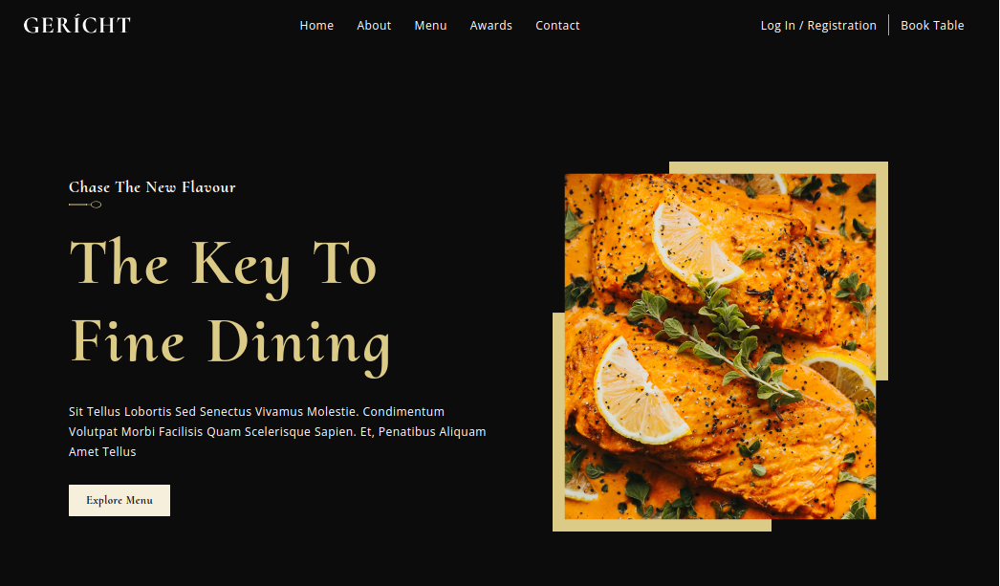
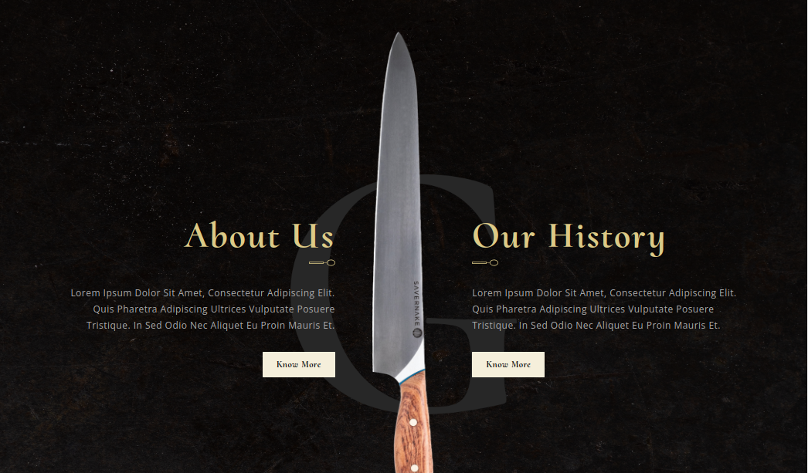
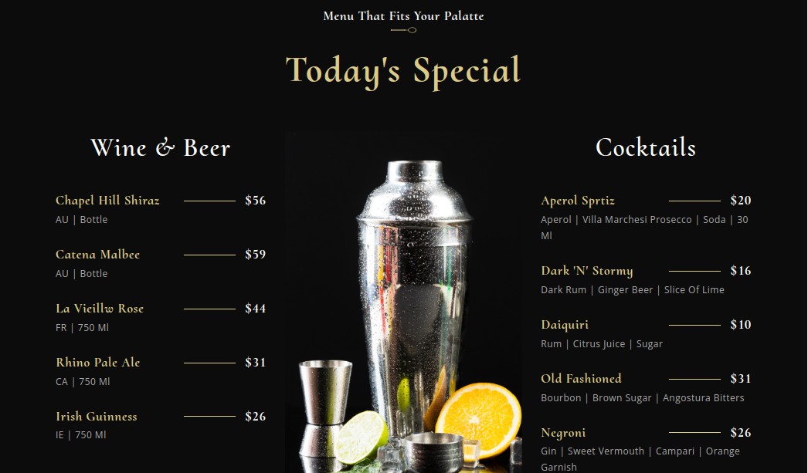
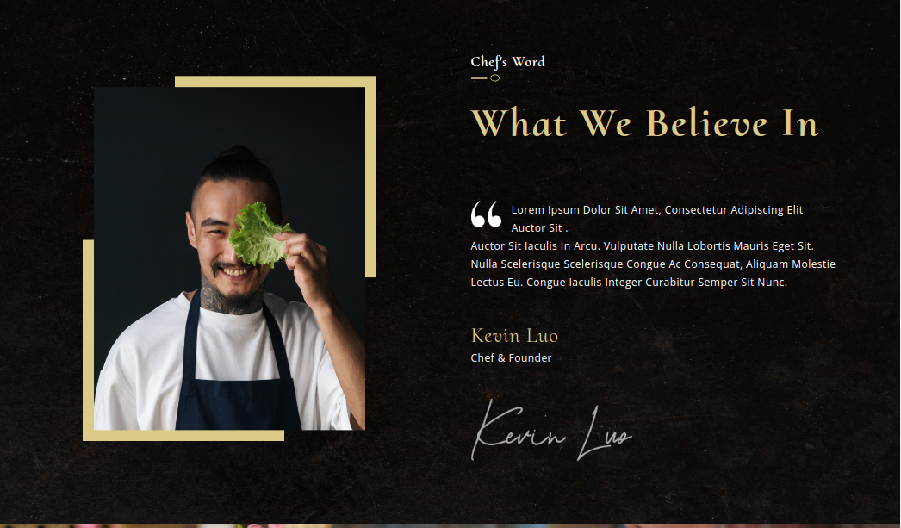
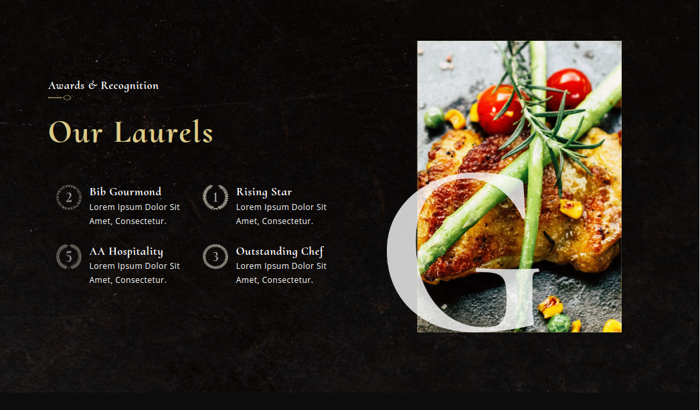
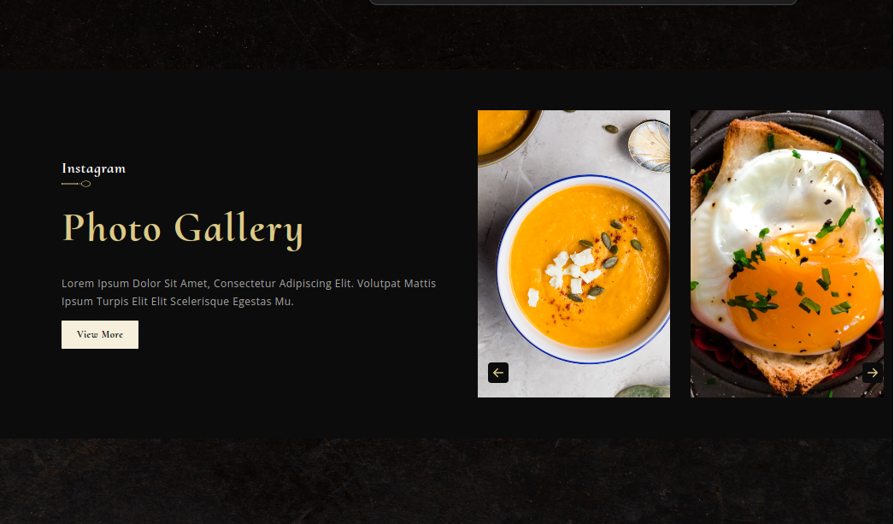
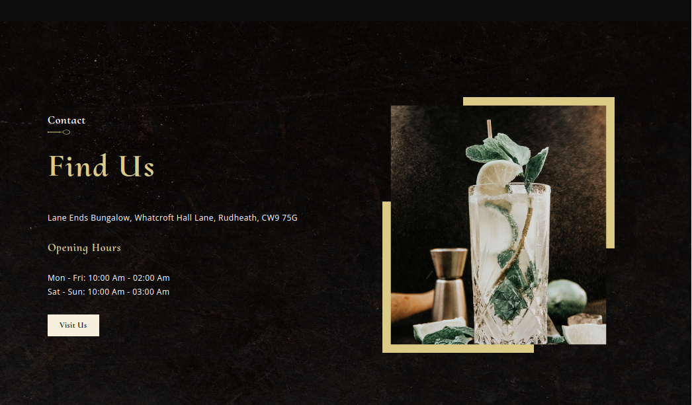
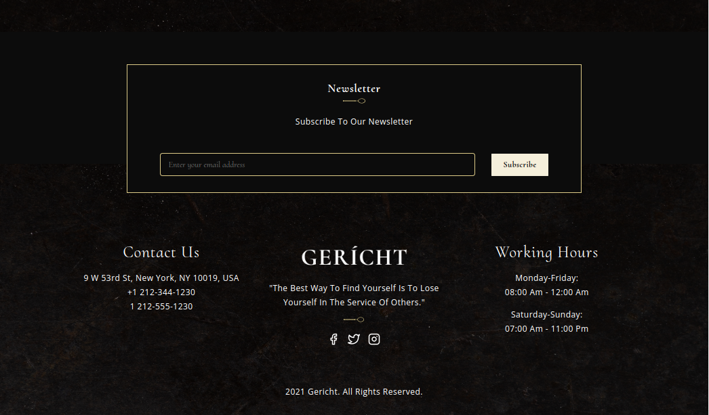

Gericht Restuarant

Implemented the following beautiful [Design](https://www.figma.com/file/yvClSI9AZBRX8UaaGEByF3/Modern-UI%2FUX%3A-Gericht?type=design&node-id=0-1&mode=design&t=uZF73sdCHG9bcBzp-0) Using React, TS and CSS.
- Used Vanilla CSS
- Experimented with the BEM namimg convention for the CSS. 
- Exclusively used React Hooks and Functional components.

## Available Scripts

In the project directory, you can run:

### `npm start`

Runs the app in the development mode.

### `npm test`

Launches the test runner in the interactive watch mode.

### `npm run build`

Builds the app for production to the `build` folder.

## ScreenShots
#### Header

#### About Us

#### Special Menu

#### Chef's Word

#### Awards

#### Gallery

#### Find Us

#### Footer
